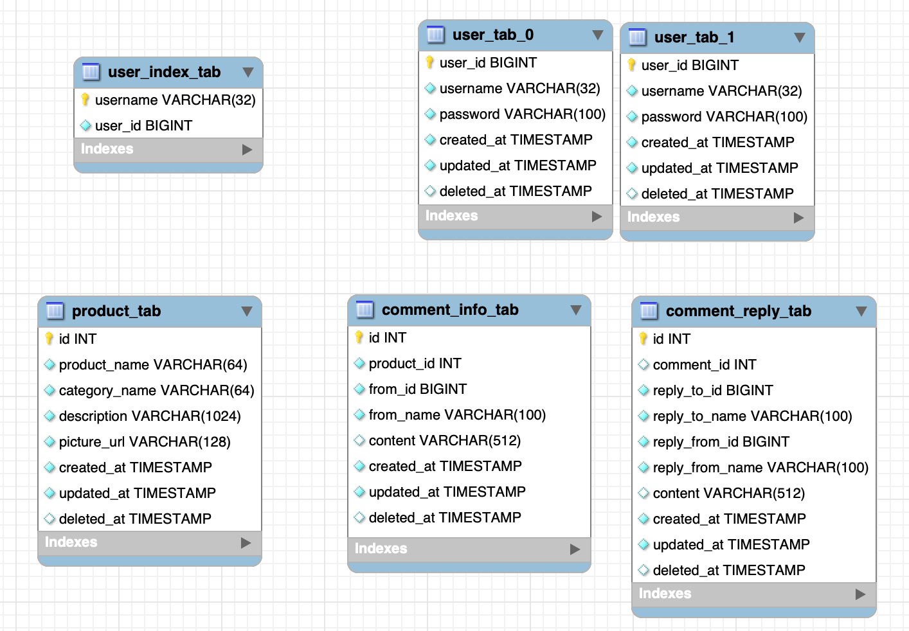
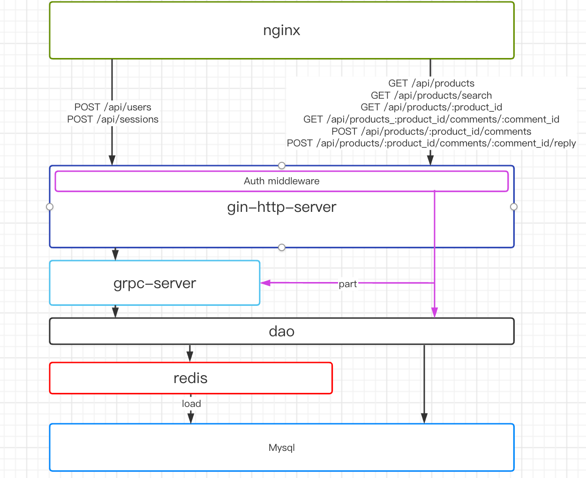
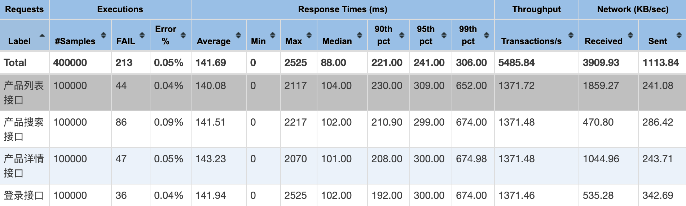

# 0 需求 overview

## 最终用户

在平台上，用户可以查看待售的新产品，并对这些产品发表评论。

- 用户需要**登录**才能查看产品，并且可以**注册**到平台上。
- 用户可以浏览**分页**的产品列表。
- 用户可以按**名称**和**类别**搜索特定产品。
- 用户可以查看产品详细信息，包括标题、描述、产品类别、产品照片和评论列表。
- 用户可以**对**产品**发表评论**（包括回复用户）。

**开发要求**  
不需要客户端应用程序的前端开发；您只需要为此任务构建API服务。

# 1 API设计

## 1.1用户相关接口

### 1.1.1 用户注册接口

- 127.0.0.1:80/api/users

- POST

- **输入参数**

| 字段名      | 类型     | 是否必填 | 校验        | 含义  |
| -------- | ------ | ---- | --------- | --- |
| username | string | 是    | len: 8-32 | 用户名 |
| password | string | 是    | len: 8-32 | 密码  |

**返回参数**

| 通用字段 | 类型     | 是否可为空 | 含义     |
| ---- | ------ | ----- | ------ |
| code | int    | 否     | 返回码    |
| msg  | string | 否     | 返回信息   |
| data | any    | 是     | 具体业务数据 |

**请求示例**

curl --location --request POST '127.0.0.1:80/api/users' \
--form 'username="laoyanjie1"' \
--form 'password="laoyanjie1"'

**返回示例**

success

```json
{
    "data": {},
    "msg": "success",
    "retcode": 0
}
```

failed

```json
{
 "data": " 用户名已存在",
 "msg": "User Register Failed",
 "retcode": 20000003
}
```

### 1.1.2 登录接口

- 127.0.0.1:80/api/sessions

- POST

- **输入参数**

| 字段名      | 类型     | 是否必填 | 校验        | 含义  |
| -------- | ------ | ---- | --------- | --- |
| username | string | 是    | len: 8-32 | 用户名 |
| password | string | 是    | len: 8-32 | 密码  |

**返回参数**

| 通用字段 | 业务字段       | 类型     | 是否可为空 | 含义         |
| ---- | ---------- | ------ | ----- | ---------- |
| code |            | int    | 否     | 返回码        |
| msg  |            | string | 否     | 返回信息       |
| data |            | any    | 是     | 具体业务数据     |
|      | username   | string | 否     | 用户名        |
|      | session_id | string | 否     | session_id |

data内的session_id仅作为一个冗余字段，真正作用在set-cookie来设置session_id

**set-cookie：session_id**

**请求示例**

curl --location --request POST '127.0.0.1:80/api/sessions'  
--form 'username="123456789"'  
--form 'password="123456789"'

**返回示例**

success

```json
{
    "data": {
        "username": "12345678",
        "session_id": "session_id_dd126e58-6c1e-47c2-8ad7-1a87d22cdee9"
    },
    "msg": "success",
    "retcode": 0
}
```

failed

```json
{
    "data": " 密码错误，请重新输入",
    "msg": "User Login Failed",
    "retcode": 20000001
}
```

## 1.2 产品相关接口

### 1.2.1 浏览产品列表接口

- 127.0.0.1:80/api/products?page_index=9&page_size=80

- GET

- **输入参数**

| 字段名        | 类型  | 是否必填 | 默认  | 校验  | 含义  |
| ---------- | --- | ---- | --- | --- | --- |
| page_index | int | 否    | 0   |     | 页码  |
| page_size  | int | 否    | 10  |     | 页大小 |

**返回参数**

| 通用字段 | 业务字段          | 子字段                 | 类型     | 是否可为空 | 含义     |
| ---- | ------------- | ------------------- | ------ | ----- | ------ |
| code |               |                     | int    | 否     | 返回码    |
| msg  |               |                     | string | 否     | 返回信息   |
| data |               |                     | any    | 是     | 具体业务数据 |
|      | product_list  |                     |        | 是     | 产品列表   |
|      | -             | product_id          | int    |       | 产品id   |
|      |               | product_name        | string |       | 产品名称   |
|      |               | category_name       | string |       | 产品类别名  |
|      |               | product_picture_url | string |       | 产品图    |
|      | product_count |                     |        |       | 产品总数   |

**请求示例**

curl --location --request GET '127.0.0.1:80/api/products?page_index=9&page_size=80' \

--header 'Cookie: session_id=6d8373eb-5f16-49b3-b37e-c59311da5129'

**返回示例**

success

```json
{
    "data": {
        "product_list": [
           {
                "product_id": 8,
                "product_name": "product_phone_8",
                "category_name": "phone",
                "product_picture_url": "https://baidu.com"
            }
        ]
    },
    "msg": "success",
    "retcode": 0
}
```

failed

```json
{
    "data": "请登录",
    "msg": "User Login Required",
    "retcode": 20000002
}
```

### 1.2.2 搜索产品接口

- 127.0.0.1:80/api/products/search?search_by=product_phone_99

- GET

- **输入参数**

| 字段名       | 类型     | 是否必填 | 默认  | 校验  | 含义   |
| --------- | ------ | ---- | --- | --- | ---- |
| search_by | string | 是    |     |     | 搜索字段 |

**返回参数**

| 通用字段 | 业务字段                | 子字段                 | 类型     | 是否可为空 | 含义     |
| ---- | ------------------- | ------------------- | ------ | ----- | ------ |
| code |                     |                     | int    | 否     | 返回码    |
| msg  |                     |                     | string | 否     | 返回信息   |
| data |                     |                     | any    | 是     | 具体业务数据 |
|      | product_search_list |                     |        | 是     | 产品搜索列表 |
|      | -                   | product_id          | int    |       | 产品id   |
|      |                     | product_name        | string |       | 产品名称   |
|      |                     | category_name       | string |       | 产品类别名  |
|      |                     | product_picture_url | string |       | 产品图    |

**请求示例**

curl --location --request GET '127.0.0.1:80/api/products/search?search_by=product_phone_99' \

--header 'Cookie: session_id=6d8373eb-5f16-49b3-b37e-c59311da5129'

**返回示例**

success

```json
{
    "data": {
        "product_search_list": [
            {
                "product_id": 99,
                "product_name": "product_phone_99",
                "category_name": "phone",
                "product_picture_url": "https://baidu.com"
            }
        ]
    },
    "msg": "success",
    "retcode": 0
}
```

failed

```json
{
    "data": "请登录",
    "msg": "User Login Required",
    "retcode": 20000002
}
```

### 1.2.3 产品详情接口

- 127.0.0.1:80/api/products/:product_id

- GET

- **输入参数**

| 字段名         | 类型  | 是否必填 | 默认  | 校验  | 含义   |
| ----------- | --- | ---- | --- | --- | ---- |
| :product_id | int | 是    |     |     | 产品id |

**返回参数**

| 通用字段 | 业务字段           | 子字段                 | 二级子字段           | 类型     | 是否可为空 | 含义     |
| ---- | -------------- | ------------------- | --------------- | ------ | ----- | ------ |
| code |                |                     |                 | int    | 否     | 返回码    |
| msg  |                |                     |                 | string | 否     | 返回信息   |
| data |                |                     |                 | any    | 是     | 具体业务数据 |
|      | product_detail |                     |                 |        | 否     | 产品详情   |
|      |                | product_id          |                 | int    |       | 产品id   |
|      |                | product_name        |                 | string |       | 产品名字   |
|      |                | product_description |                 | string |       | 产品描述   |
|      |                | category_name       |                 | string |       | 产品类别   |
|      |                | product_pirture_url |                 | string |       | 产品照片   |
|      |                | comment_list        |                 |        | []    | 产品评论   |
|      |                | -                   | comment_id      | int    |       | 评论id   |
|      |                |                     | from_name       | string |       | 评论人    |
|      |                |                     | comment_content | string |       | 评论内容   |
|      |                |                     | created_at      | string |       | 评论时间   |

**请求示例**

curl --location --request GET '127.0.0.1:80/api/products/9' \

--header 'Cookie: session_id=6d8373eb-5f16-49b3-b37e-c59311da5129'

**返回示例**

success

```json
{
    "data": {
        "ProductDetail": {
            "product_id": 1,
            "product_name": "product_phone_1",
            "product_description": "苹果手机",
            "comment_list": [
                {
                    "comment_id": 1,
                    "from_name": "12345678",
                    "content": "这商品真不错",
                    "created_at": "2022-08-04T17:24:56+08:00"
                }
            ]
        }
    },
    "msg": "success",
    "retcode": 0
}
```

failed

```json
{
    "data": "请登录",
    "msg": "User Login Required",
    "retcode": 20000002
}
```

### 1.2.3 查看产品评论回复接口

- 127.0.0.1:80/api/products/:product_id/comments/:comment_id

- GET

- **输入参数**

| 字段名         | 类型  | 是否必填 | 默认  | 校验  | 含义   |
| ----------- | --- | ---- | --- | --- | ---- |
| :product_id | int | 是    |     |     | 产品id |
| :comment_id | int | 是    |     |     | 评论id |

**返回参数**

| 通用字段 | 业务字段    | 子字段             | 二级子字段           | 类型     | 是否可为空 | 含义      |
| ---- | ------- | --------------- | --------------- | ------ | ----- | ------- |
| code |         |                 |                 | int    | 否     | 返回码     |
| msg  |         |                 |                 | string | 否     | 返回信息    |
| data |         |                 |                 | any    | 是     | 具体业务数据  |
|      | comment |                 |                 |        | 否     | 评论详情    |
|      |         | comment_id      |                 | int    |       | 评论id    |
|      |         | from_name       |                 | string |       | 评论人     |
|      |         | comment_content |                 | string |       | 评论内容    |
|      |         | created_at      |                 | string |       | 评论时间    |
|      |         | reply_list      |                 | string | []    | 回复      |
|      |         | -               | reply_id        | int    |       | 回复id    |
|      |         |                 | reply_from_id   | int64  |       | 回复者id   |
|      |         |                 | reply_from_name | string |       | 回复者name |
|      |         |                 | reply_content   | string |       | 回复内容    |
|      |         |                 | created_at      | string |       | 回复时间    |

**请求示例**

curl --location --request GET '127.0.0.1:80/api/products/1/comments/1' \

--header 'Cookie: session_id=6d8373eb-5f16-49b3-b37e-c59311da5129'

**返回示例**

success

```json
{
    "data": {
        "comment": {
            "comment_id": 1,
            "product_id": 1,
            "from_name": "12345678",
            "comment_content": "这商品真不错",
            "created_at": "2022-08-04T17:24:56+08:00",
            "reply_list": [
                {
                    "reply_id": 1,
                    "reply_from_id": 2,
                    "reply_from_name": "12345678",
                    "reply_content": "确实",
                    "created_at": "2022-08-04T18:51:00+08:00"
                }
            ]
        }
    },
    "msg": "success",
    "retcode": 0
}
```

failed

```json
{
    "data": "请登录",
    "msg": "User Login Required",
    "retcode": 20000002
}
```

### 1.2.4 评论产品接口

- 127.0.0.1:80/api/products/:product_id/comments

- POST

- **输入参数**

| 字段名             | 类型     | 是否必填 | 默认  | 校验  | 含义   |
| --------------- | ------ | ---- | --- | --- | ---- |
| :product_id     | int    | 是    |     |     | 产品id |
| comment_content | string | 是    |     |     | 评论内容 |

**返回参数**

| 通用字段 | 业务字段       | 类型     | 是否可为空 | 含义         |
| ---- | ---------- | ------ | ----- | ---------- |
| code |            | int    | 否     | 返回码        |
| msg  |            | string | 否     | 返回信息       |
| data |            |        |       |            |
|      | comment_id | uint   | 是     | comment_id |

**请求示例**

curl --location --request POST '127.0.0.1:80/api/products/2/comments' \

--header 'Cookie: session_id=6d8373eb-5f16-49b3-b37e-c59311da5129' \

--form 'comment_content="好用！好用"'

**返回示例**

success

```json
{
    "data": {
        "comment_id": 11
    },
    "msg": "success",
    "retcode": 0
}
```

failed

```json
{
    "data": "请登录",
    "msg": "User Login Required",
    "retcode": 20000002
}
```

### 1.2.5 回复评论接口

- 127.0.0.1:80/api/products/:product_id/comments/:comment_id/reply

- POST

- **输入参数**

| 字段名           | 类型     | 是否必填 | 默认  | 校验  | 含义     |
| ------------- | ------ | ---- | --- | --- | ------ |
| :product_id   | int    | 是    |     |     | 产品id   |
| :comment_id   | int    | 是    |     |     | 主评论id  |
| reply_to_id   | int64  | 是    |     |     | 被回复人id |
| reply_to_name | string | 是    |     |     | 被回复人名字 |
| reply_content | string | 是    |     |     | 回复内容   |

**返回参数**

| 通用字段 | 业务字段             | 类型     | 是否可为空 | 含义   |
| ---- | ---------------- | ------ | ----- | ---- |
| code |                  | int    | 否     | 返回码  |
| msg  |                  | string | 否     | 返回信息 |
| data |                  |        |       |      |
|      | comment_reply_id | uint   | 是     | 回复id |

**请求示例**

curl --location --request POST '127.0.0.1:80/api/products/3/comments/12/reply' \

--header 'Cookie: session_id=6d8373eb-5f16-49b3-b37e-c59311da5129' \

--form 'reply_to_id="1"' \

--form 'reply_to_name="12345678"' \

--form 'reply_content="nice!!!!!!!!!"'

**返回示例**

success

```json
{
    "data": {
        "comment_reply_id": 18
    },
    "msg": "success",
    "retcode": 0
}
```

failed

```json
{
    "data": "请登录",
    "msg": "User Login Required",
    "retcode": 20000002
}
```

**接口描述**

该接口为对用户的评论进行回复。具体实现就是，校验登录后，往comment_reply_tab上插入该评论记录。该表上comment_id上面有索引，如果需要查询一条评论的所有回复，直接通过select+where来查询即可。

# 2 错误码 Retcode

| http status code | retcode  | msg                         |
| ---------------- | -------- | --------------------------- |
| 200              | 0        | success                     |
| 500              | 10000000 | Server Error                |
| 400              | 10000001 | Invalid Params              |
| 404              | 10000002 | Not Found                   |
| 502              | 20000000 | Session Error               |
| 502              | 20000001 | User Login Failed           |
| 502              | 20000002 | User Login Required         |
| 502              | 20000003 | User Register Failed        |
| 502              | 30000001 | Product List Get Failed     |
| 502              | 30000002 | Product Search Get Failed   |
| 502              | 30000003 | Product Detail Failed       |
| 502              | 40000001 | Comment Detail Get Failed   |
| 502              | 40000002 | Comment Create Failed       |
| 502              | 40001001 | Comment Reply Create Failed |

# 3 运行流程

## 3.1 环境准备

1. 本项目运行于go 1.18.5下，可通过以下安装

```shell
brew install go@1.18
# 然后自行配置GOPATH和GOPROXY
```

2. 以下为必须组件

```shell
brew install redis@6.2
brew services start redis@6.2


brew install mysql
#  8.0.29 
brew services start mysql


brew install nginx
# 1.23.1
```

3. 使用jmeter作为压测

```shell
brew install java
# 18.0.2

brew install jmeter
```

## 3.2 数据库准备

**概览**



### 3.2.1 建表

1. **user_index_tab**

username -> user_id 的映射表

```sql
CREATE TABLE `user_index_tab` (
  `username` varchar(32) COLLATE utf8mb4_unicode_ci NOT NULL COMMENT '用户名',
  `user_id` bigint NOT NULL COMMENT '用户id',
  PRIMARY KEY (`username`)
) ENGINE=InnoDB DEFAULT CHARSET=utf8mb4 COLLATE=utf8mb4_unicode_ci COMMENT='用户名用户id映射表';
```

2. **user_tab_xxx**

100个用户表

```sql
DELIMITER $$
CREATE DEFINER=`root`@`localhost` PROCEDURE `create_tables`()
BEGIN

DECLARE `@i` INT(11);
DECLARE `@createSql` VARCHAR(2560);
SET `@i` = 0;
WHILE `@i` < 100 DO
    -- 创建表        
SET @createSql = CONCAT(
    "CREATE TABLE IF NOT EXISTS `user_tab_", `@i`,"`",
    "(
           `user_id` BIGINT not null comment '用户id',
           `username` VARCHAR(32) NOT NULL comment '用户名',
           `password` VARCHAR(100) NOT NULL comment '密码',
           `created_at` timestamp NOT NULL DEFAULT NOW() comment '创建时间',
           `updated_at` timestamp NOT NULL DEFAULT NOW() comment '更新时间',
           `deleted_at` timestamp comment '删除时间',
           Unique key (`username`),
           PRIMARY KEY ( `user_id` )
        )ENGINE=InnoDB 
        DEFAULT CHARSET=utf8mb4
        COLLATE=utf8mb4_unicode_ci
        COMMENT='用户表';
"
);
PREPARE stmt FROM @createSql;
EXECUTE stmt;
SET `@i` = `@i` + 1;

END WHILE;
END$$
DELIMITER ;


CALL `create_tables`();
```

3. **product_tab**

```sql
CREATE TABLE `product_tab` (
  `id` int unsigned NOT NULL AUTO_INCREMENT COMMENT '产品id',
  `product_name` varchar(64) COLLATE utf8mb4_unicode_ci NOT NULL COMMENT '产品名字',
  `category_name` varchar(64) COLLATE utf8mb4_unicode_ci NOT NULL COMMENT '类别名字',
  `description` varchar(1024) COLLATE utf8mb4_unicode_ci NOT NULL COMMENT '产品描述',
  `picture_url` varchar(128) COLLATE utf8mb4_unicode_ci NOT NULL COMMENT '照片url',
  `created_at` timestamp NOT NULL DEFAULT CURRENT_TIMESTAMP COMMENT '创建时间',
  `updated_at` timestamp NOT NULL DEFAULT CURRENT_TIMESTAMP COMMENT '更新时间',
  `deleted_at` timestamp NULL DEFAULT NULL COMMENT '删除时间',
  PRIMARY KEY (`id`),
  KEY `category_name` (`category_name`),
  KEY `product_name` (`product_name`)
) ENGINE=InnoDB AUTO_INCREMENT=5000100 DEFAULT CHARSET=utf8mb4 COLLATE=utf8mb4_unicode_ci COMMENT='产品表';
```

4. **comment_info_tab**

```sql
CREATE TABLE `comment_info_tab` (
  `id` int unsigned NOT NULL AUTO_INCREMENT COMMENT '评论id',
  `product_id` int unsigned NOT NULL COMMENT '产品id',
  `from_id` bigint NOT NULL COMMENT '评论者id',
  `from_name` varchar(100) CHARACTER SET utf8mb4 COLLATE utf8mb4_unicode_ci NOT NULL COMMENT '评论者名字',
  `content` varchar(512) CHARACTER SET utf8mb4 COLLATE utf8mb4_unicode_ci DEFAULT NULL COMMENT '评论内容',
  `created_at` timestamp NOT NULL DEFAULT CURRENT_TIMESTAMP COMMENT '创建时间',
  `updated_at` timestamp NOT NULL DEFAULT CURRENT_TIMESTAMP COMMENT '更新时间',
  `deleted_at` timestamp NULL DEFAULT NULL COMMENT '删除时间',
  PRIMARY KEY (`id`),
  KEY `product_id` (`product_id`)
) ENGINE=InnoDB AUTO_INCREMENT=56 DEFAULT CHARSET=utf8mb4 COLLATE=utf8mb4_unicode_ci COMMENT='评论主表';
```

5. **comment_reply_tab**

```sql
CREATE TABLE `comment_reply_tab` (
  `id` int unsigned NOT NULL AUTO_INCREMENT COMMENT '回复id',
  `comment_id` int unsigned DEFAULT NULL COMMENT '主评论id',
  `reply_to_id` bigint NOT NULL COMMENT '被回复人id',
  `reply_to_name` varchar(100) CHARACTER SET utf8mb4 COLLATE utf8mb4_unicode_ci NOT NULL COMMENT '被回复人名字',
  `reply_from_id` bigint NOT NULL COMMENT '回复者id',
  `reply_from_name` varchar(100) CHARACTER SET utf8mb4 COLLATE utf8mb4_unicode_ci NOT NULL COMMENT '回复者名字',
  `content` varchar(512) CHARACTER SET utf8mb4 COLLATE utf8mb4_unicode_ci DEFAULT NULL COMMENT '回复内容',
  `created_at` timestamp NOT NULL DEFAULT CURRENT_TIMESTAMP COMMENT '创建时间',
  `updated_at` timestamp NOT NULL DEFAULT CURRENT_TIMESTAMP COMMENT '更新时间',
  `deleted_at` timestamp NULL DEFAULT NULL COMMENT '删除时间',
  PRIMARY KEY (`id`),
  KEY `comment_id` (`comment_id`)
) ENGINE=InnoDB AUTO_INCREMENT=55 DEFAULT CHARSET=utf8mb4 COLLATE=utf8mb4_unicode_ci COMMENT='评论回复表';
```

## 3.3修改配置

### 3.3.1项目内部配置

项目内路径：    **config/config.yaml**


### 3.3.2 nginx配置

以下配置在nginx.conf中

```shell
# 代表工作进程数，由于是多核cpu，可以设为与cpu核数相同
worker_processes  4;

pid        logs/nginx.pid;


events {
    # 1.worker_connections与两个指标有重要关联，一是内存，二是操作系统级别的“进程最大可打开文件数”。
    # 2.内存：每个连接数分别对应一个read_event、一个write_event事件，一个连接数大概占用232字节，2个事件总占用96字节，那么一个连接总共占用328字节，通过数学公式可以算出100000个连接数大概会占用 31M = 100000 * 328 / 1024 / 1024，当然这只是nginx启动时，connections连接数所占用的nginx。
    # 3.进程最大可打开文件数：进程最大可打开文件数受限于操作系统，可通过 ulimit -n 命令查询，本机为2560，2560*4 = 10240。故取10000
    worker_connections  10000;
}


http {
    include       mime.types;
    default_type  application/octet-stream;


    sendfile        on;

    # keepalive_timeout设置keep-alive客户端(浏览器)连接在服务器端(nginx端)保持开启的超时值（默认75s）
    keepalive_timeout  120;

    # keepalive_requests指令用于设置一个keep-alive连接上可以服务的请求的最大数量，当最大请求数量达到时，连接被关闭。默认是100。对于QPS较高的场景，非常有必要加大这个参数，以避免出现大量连接被生成再抛弃的情况，减少TIME_WAIT。
    keepalive_requests 10000;


    upstream mysvr{
        server 127.0.0.1:8000;
        # keepalive设置到upstream服务器的空闲keepalive连接的最大数量。为了避免出现连接震荡，必须考虑加大这个参数
        keepalive 1000;
    }

    server {
        listen       80;
        server_name  127.0.0.1;
        charset utf-8;

        location / {
            proxy_pass http://mysvr;

            # 设置以下两项，从而让nginx和后端server之间保持长连接
            proxy_http_version 1.1;
            proxy_set_header Connection "Keep-Alive";
        }

        error_page   500 502 503 504  /50x.html;

    }


    include servers/*;
}
```

## 3.4 运行

```shell
# 在项目路径下依次执行以下命令
go init 
go mod tidy
go run cmd/grpc-server/main.go
go run cmd/http-server/main.go
```

# 4 项目架构

## 4.1 文件结构

+ benchmark    性能测试相关

+ cmd    启动入口及配置加载

+ config     配置

+ global      全局变量

+ internel    系统内部
  
  + conn    创建连接（rpc连接、redis连接、mysql连接）
  
  + constant     常量
  
  + dao    dao层（包括redis缓存、mysql数据库的数据存取）
  
  + middleware    中间件
  
  + model    下层数据库存取
  
  + proto    grpc的codec及其生成文件
  
  + service    业务层
  
  + web    路由层（或者叫controller层）

+ log     存放日志文件

+ pkg     工具相关的包

## 4.2 项目架构



# 5 性能测试

## 5.1 数据准备

+ 构造1000万用户数据

```sql
DELIMITER $$
CREATE DEFINER=`root`@`localhost` PROCEDURE `insert_user_table`()
BEGIN
    DECLARE num BIGINT DEFAULT 10000000;
    DECLARE i BIGINT DEFAULT 0;
    DECLARE seq BIGINT DEFAULT 0;
    WHILE i < num DO

    INSERT INTO `user_index_tab`(username,user_id)VALUES (CONCAT('fake_username_',i),i);


    SET seq = i % 100;

    set @data_sql = concat('insert into `user_tab_',`seq`,'`(`user_id`,`username`,`password`)values (',`i`,',"fake_username_',`i`,'","fake_username_',`i`,'");');
    PREPARE stmt FROM @data_sql;
    EXECUTE stmt;


    SET i = i + 1;
    END WHILE;
END$$
DELIMITER ;


call insert_user_table();
```

+ 构造500万产品数据 及其评论

```sql
# 构造产品数据

DELIMITER $
CREATE PROCEDURE insert_product_table()
BEGIN
    DECLARE num BIGINT DEFAULT 5000000;
    DECLARE i BIGINT DEFAULT 0;
    DECLARE seq BIGINT DEFAULT 0;
    WHILE i < num DO

    INSERT INTO `product_tab`(`product_name`,`category_name`,`description`,`picture_url`) VALUES (CONCAT('product_',i),'category_i','phone','https://www.baidu.com/img/PCtm_d9c8750bed0b3c7d089fa7d55720d6cf.png');

    SET i = i + 1;
    END WHILE;
END;
$

DELIMITER ;  

CALL `insert_product_table`();
```

```sql
# 构造产品评论数据

DELIMITER $
CREATE PROCEDURE insert_comment_info_table()
BEGIN
    DECLARE num BIGINT DEFAULT 5000000;
    DECLARE i BIGINT DEFAULT 1;

    WHILE i < num DO

    INSERT INTO `comment_info_tab`(`product_id`,`from_id`,`from_name`,`content`) VALUES (i,1558371459036876800,'123456789','很好用');

    SET i = i + 1;
    END WHILE;
END;
$

call insert_comment_info_table();
```

## 5.2 插入可测试的数据

```shell
go run benchmark/userDataConstruct.go
```

从而生成可测试的两百个用户。

## 5.3 运行jmeter

```shell
jmeter
```

### 5.3.1 登录接口

需要使用到上面插入的200个用户，使用benchmark/jmeter/csvConfig.txt里面的列表。

参考[自定义变量模拟多用户-jmeter不同用户请求](https://blog.csdn.net/yaorongke/article/details/82813691)里面来导入该文件。

### 5.3.2 产品相关接口

需要添加cookie

```
session_id=e944b74a-5694-4b4c-b5eb-49dfc4685a70; Path=/; Domain=127.0.0.1; HttpOnly; Expires=Mon, 15 Aug 2022 08:24:57 GMT;
```

### 5.3.3 运行环境

  型号名称： MacBook Pro

  芯片： Apple M1 Pro

  核总数： 10（8性能和2能效）

  内存： 16 GB

### 5.3.4 压测数据

| 接口   | 接口路径                 | 线程数 | 样本数    | 平均值(ms) | 中位数(ms) | QPS   |
| ---- | -------------------- | --- | ------ | ------- | ------- | ----- |
| 登录   | /api/sessions        | 200 | 100000 | 11      | 9       | 16728 |
| 产品列表 | /api/products        | 200 | 100000 | 11      | 9       | 16108 |
| 产品搜索 | /api/products/search | 200 | 100000 | 17      | 11      | 11134 |
| 产品详情 | /api/products/4      | 200 | 100000 | 17      | 10      | 10311 |

1. 线程数使用200个线程是基于文档的登录接口要求“200个唯一用户”的考虑，其他接口继续沿用，从而方便比较。

2. 以上表格的数据均是测试单一接口的结果。

3. 使用jmeter生成测试报告时，是同时测试4个接口，共800个线程运行。数据如下：



可以看到：800个线程同时运行会导致线程上下文频繁切换，使得QPS基本减半（图中约5485.84/s）。

~~详细报告如下目录：~~

~~benchmark/report/index.html~~

### 5.3.5 运行环境监控

由于项目运行在本机goland下，以下为记录goland进程的cpu占用和内存占用

| 接口   | cpu占用（max值） | 内存（max值） |
| ---- | ----------- | -------- |
| 登录   | 313.0%      | 3415M    |
| 产品详情 | 249.8%      | 3272M    |
| 产品搜索 | 316.0%      | 3422M    |
| 产品列表 | 355.6%      | 3444M    |

### 5.3.6 压测分析

1. 在本机运行时，系统监控不如在容器(或虚拟机)内这么直观，只能监控到service进程的运行，可以看到在运行时，cpu占用还是比较高的，主要原因有：密码的加解密、数据的封装、数据类型的转换，这些都是比较耗费cpu的操作。

2. 在压测的这四个接口中，除了产品列表没有加缓存外，其他都加了缓存。因而运行时，io是比较低的。

3. **注：以上压测数据是在进行数据预热的情况下得到的结果，如果初次测试，数据还没有缓存到redis的情况下，QPS会明显下降。**（初次测试，另外一个可能的原因是长连接的建立也会耗费一定的时间）

# 6 开源组件的使用

+ gin-gonic/gin 作为本项目的web框架使用

+ grpc/grpc-go 作为本项目user service的一个rpc使用

+ go-gorm/gorm 作为本项目操作数据库的orm框架

+ /go-redis/redis 作为本项目的redis客户端

+ spf13/viper 作为本项目的配置组件

+ spf13/cast 用作数据类型的转换

+ bwmarrin/snowflake 作为本项目user_id的id生成方式

# 7 关于缓存

本项目的缓存功能 internel/dao/cahce/LodableCache.go参照eko/gocache实现，并添加了以下功能：

+ 自动load的缓存可自定义超市时间

+ 添加Mget。

由于后续测试中，对于产品列表使用Mget方法并没有显著提升性能，故没有使用。

# 8 关于user表的sharding

本项目的user表采用了水平分表的做法来存储1000万个用户。

+ 创建用户时：
  
  + 开启事务
    
    + 生成雪花user_id，并对100取余得到表序号xxx
    
    + insert into user_index_tab ...
    
    + insert into user_xxx_tab ...
  
  + 提交事务

+ 查找用户时：
  
  +                      user_index_tab                    user_xxx_tab
  
  + username ------------------------> user_id ------------------------> user

# 9 关于登录和注册的密码加密算法

+ **BCrypt加密：** 一种加盐的单向Hash，不可逆的加密算法，同一种明文（plaintext），每次加密后的密文都不一样，而且不可反向破解生成明文，破解难度很大，更加安全。

+ **MD5加密：** 是不加盐的单向Hash，不可逆的加密算法，同一个密码经过hash的时候生成的是同一个hash值，在大多数的情况下，有些经过md5加密的方法将会被破解。

相对来说，BCrypt比MD5更安全，但加密更慢。本次项目为了达到一定的QPS要求，故使用相对更快的MD5+盐值加密。在真正的生产系统，为了追求更好的安全性，宜使用BCrypt。
